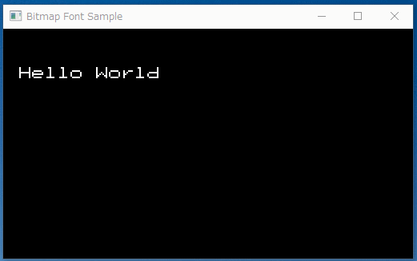

glbitmfont.h
============

Use glbitmap() to draw bitmap fonts in OpenGL. It can be used by simply including a single header file.

Support only monospace fonts. ASCII code 0x20 - 0x7f.

Screenshots
-----------



Environment
-----------

* Windows10 x64 22H2
* MinGW gcc 6.3.0 (SourceForge version)
* MinGW gcc 9.2.0 (OSDN version)
* MSYS2 gcc 13.2.0

glbitmfont_sample.c requests glfw3.

Usage
-----

```
#include "glbitmfont.h"

// ...

// draw text
glColor4f(1.0, 1.0, 1.0, 1.0);
glRasterPos2f(20, 64);
glBitmapFontDrawString("Hello World", GL_FONT_PET2015);
```

```
void glBitmapFontDrawString(char *str, int kind)

kind:
  GL_FONT_PET2015
  GL_FONT_PROFONT
  GL_FONT_SHNM8x16R
  GL_FONT_SHNM8x16RX2
  GL_FONT_TERU24B
```

License
-------

program part : CC0 / Public Domain

### Font license

* [pet2015 (16x16 dot)](http://blawat2015.no-ip.com/~mieki256/diary/202310301.html#202310301) : CC0 / Public Domain
* [Profont (12x22 dot)](https://tobiasjung.name/profont/) : MIT License
* [Shinonome (shnm8x16r.bdf) (8x16, 16x32 dot)](http://openlab.ring.gr.jp/efont/shinonome/) : Public Domain
* [Terminus (ter-u24b.bdf) (12x24 dot)](https://terminus-font.sourceforge.net/) : SIL Open Font License, Version 1.1.

Author
------

[mieki256](https://github.com/mieki256)

